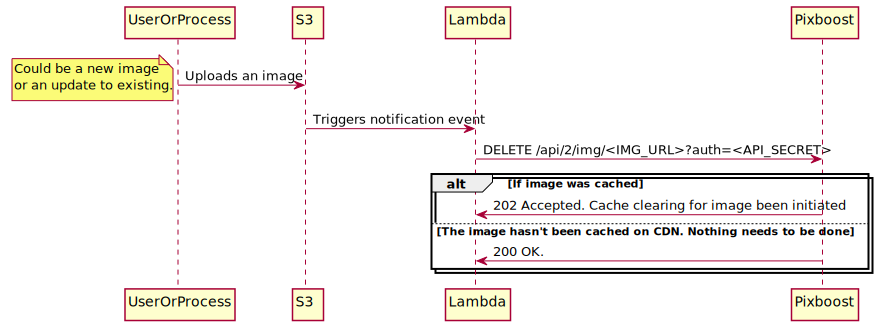

# aws-s3-invalidate-cdn

[](https://travis-ci.org/Pixboost/aws-s3-invalidate-cdn)

AWS Lambda that listens on S3 events and invalidates Pixboost Images CDN cache.



Table of Contents:

* [Deploying](#deploying)
    * [Lambda](#lambda-function)
    * [Setup S3 to Lambda notification](#setup-s3-to-lambda-notification)
* [Developing](#developing)

## Deploying

We assume that you already have S3 bucket where images are getting uploaded.

### Lambda Function

Lambda code is located in lambda/ folder. We recommend to deploy it using Cloud Formation (CF). 
However you can also deploy and setup it manually [following this instruction](https://docs.aws.amazon.com/lambda/latest/dg/with-s3-example.html). 

You need to generate CF stack to include latest code into it. To do so you need Nodejs 8+ installed.
To generate stack:

* `cd lambda`
* `npm install`

Generated CF stack will be in lambda/cf.yaml file.

You can deploy stack by executing a command:

```
aws cloudformation create-stack \ 
  --stack-name invalidate-image-cdn-lambda \
  --template-body file://lambda/cf.yaml \
  --parameters \
  ParameterKey=ImagesDomain,ParameterValue=<https://pixboost> \
  ParameterKey=ApiSecret,ParameterValue=<API-SECRET> \
  ParameterKey=ImageUrlPrefix,ParameterValue=<https://yoursite.com> \
  ParameterKey=LambdaRole,ParameterValue=<RoleArn> \
  ParameterKey=Debug,ParameterValue=<0|1> \
  --region us-east-1
```

You need to set parameters for the command above:

* ImagesDomain - domain to send invalidate request to. 
In most cases it's https://pixboost.com. But, it could be different 
if custom domain name setup and there is a corporate firewall rules 
preventing access to pixboost.com

* ApiSecret - API secret that's been given you by Pixboost team.

* ImageUrlPrefix - Image prefix that will be substituted with S3 item prefix. For instance,
if an image URL on website is https://www.site.com/images/logo.png and S3 key is images/logo.png then
parameter should be `https://www.site.com`. Note that Lambda will add `/` between prefix and S3 item key.

* LambdaRole - ARN of the IAM role that Lambda will be executed by. Lambda doesn't need
any special permissions and [this example](https://docs.aws.amazon.com/lambda/latest/dg/with-s3-example.html#with-s3-create-execution-role)
should work.

* Debug - if passed as "1" then will output debug logs

### Setup S3 to Lambda notification

To setup S3 bucket notification that will trigger the lambda function:

* `aws s3api put-bucket-notification-configuration --bucket <IMAGES_BUCKET> --notification-configuration file://event-configuration.json`

<IMAGES_BUCKET> - name of the source bucket

event-configuration.json:

```json
{
  "LambdaFunctionConfigurations": [
    {
      "Id": "invalidate-image-cdn",
      "LambdaFunctionArn": "<LAMBDA_ARN>",
      "Events": ["s3:ObjectCreated:*"]
    }
  ]
}
```

<LAMBDA_ARN> - ARN of the lambda function from the previous section.

## Developing

We are using [localstack](https://github.com/localstack/localstack) for mocking AWS.

* `docker network create invalidatecdn` - once
* `docker-compose up -d`
* `bash local-setup.sh`

To test:

`cd test && npm test`

Get Local Lambda Logs: 
* `aws --endpoint-url=http://localhost:4586 --region us-east-1 logs describe-log-groups`
* `aws --endpoint-url=http://localhost:4586 --region us-east-1 logs describe-log-streams --log-group-name /aws/lambda/invalidate-cdn`
* `aws --endpoint-url=http://localhost:4586 --region us-east-1 logs get-log-events --log-group-name /aws/lambda/invalidate-cdn --log-stream-name "+51178/02/10/[$LATEST]b27ee410"`

Or:
* `docker ps -a`
* Find first `lambci/lambda:nodejs8.10` container
* `docker logs <CONTAINER_ID_FROM_PREVIOUS_COMMAND>`
